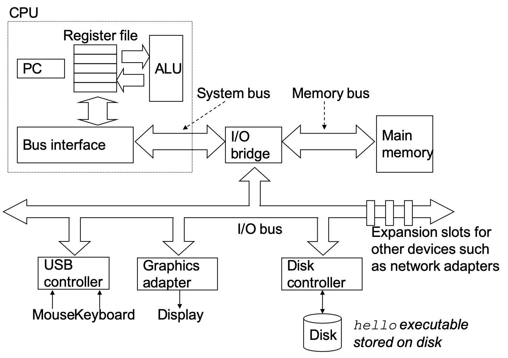
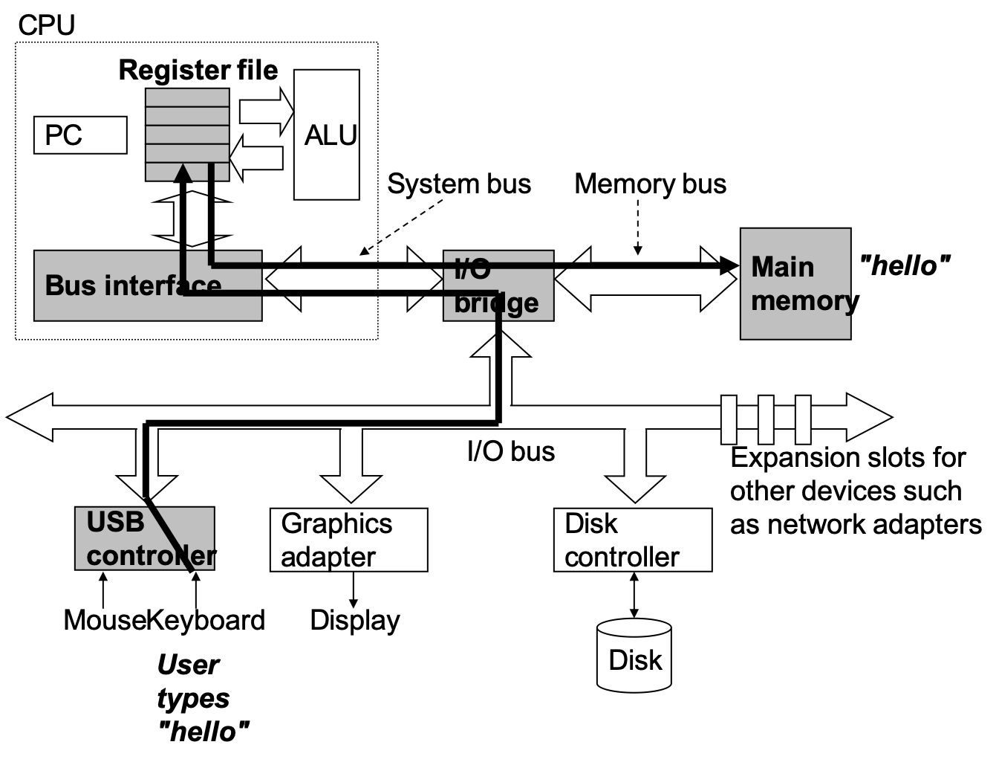
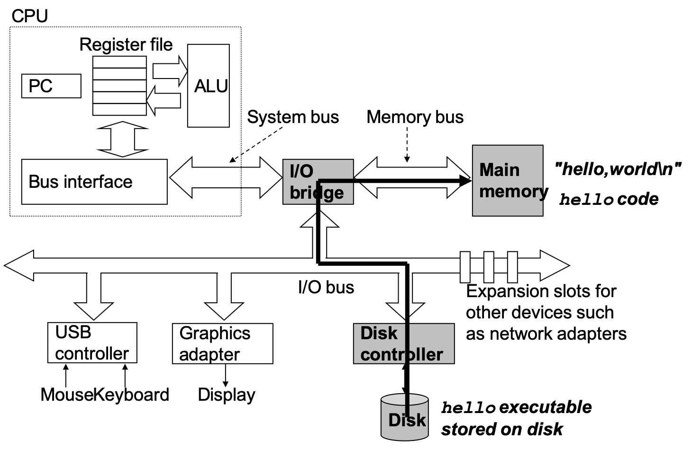
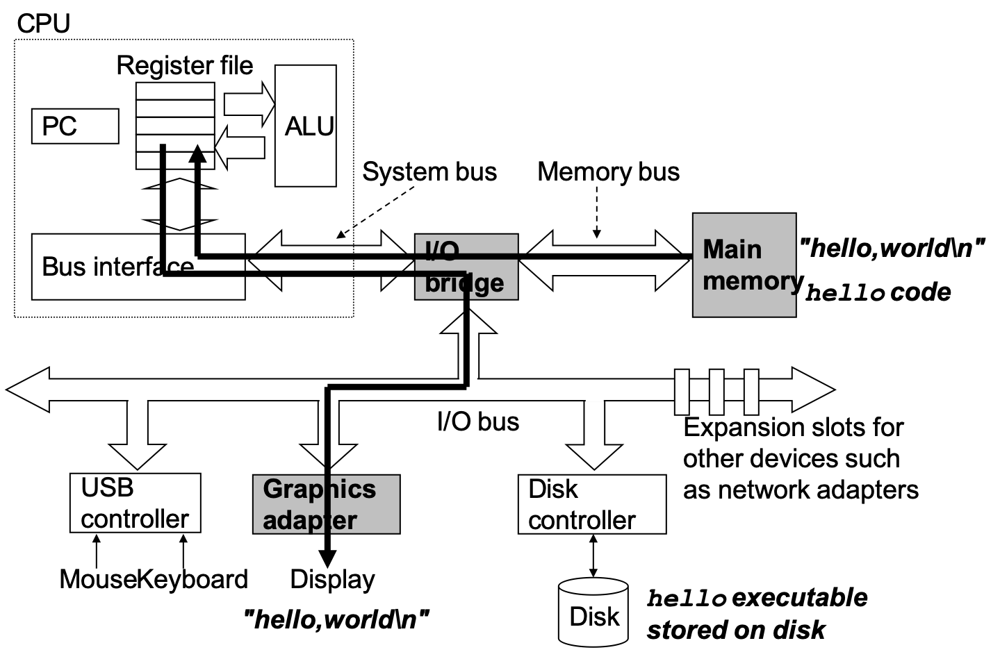

# 第1章 计算机系统漫游

漫游 hello.c 的生命周期: 被程序员创建 -> 在系统上运行 -> 输出简单的消息 -> 终止

## 1.1 信息就是位 + 上下文
源程序 hello.c 实际是一个由 0 和 1 组成的位(比特)序列. 8位 == 1字节.

hello.c 程序以字节序列的方式存储于文件中, 每个字节都有一个整数值, 对应于某些字符. (如 97 对应 a)

系统中的所有信息, 都是由一串比特表示的, 区分不同数据对象的唯一方法是我们读到这些数据对象时的`上下文`. (同一个字节序列在不同上下文中表示可能不同)


## 1.2 程序被其他程序翻译成不同的格式
```shell
# gcc 编译器驱动程序将 hello.c 翻译成可执行目标文件 hello
gcc -o hello hello.c
```
`编译系统`包括: 预处理器 -> 编译器 -> 汇编器 -> 链接器


1. 预处理: 读取以 # 开头的命令, 将 `hello.c`(文本文件) 修改为 `hello.i`(文本文件)

2. 编译: 将 `hello.i` 翻译成`汇编语言程序 hello.s`(文本文件)

3. 汇编: 将 `hello.s` 翻译成`机器语言指令`, 并打包成 `可重定位目标程序 hello.o`(二进制文件)

4. 链接: 将所调用的 `printf` 函数所在的 `printf.o` 这一预编译好的目标文件合并到 `hello.o`, 得到 `可执行目标文件 hello`, 可以被载入内存, 由系统执行.


## 1.3 了解编译系统如何工作是大有益处的
- 优化程序性能方式.
- 理解链接时出现的错误
- 避免安全漏洞


## 1.4 处理器读并解释储存在内存中的指令
```shell
 ./hello
# hello, world
```
### 1.4.1 系统的硬件组成


1. `总线`: `贯穿整个系统的一组电子管道, 携带信息字节并负责在各个部件间传递.`通常传送定长的字节块(也就是`字(word)`), 字中的字节数(即`字长`)是一个基本的系统参数, 各个系统中不尽相同(4字节(32位)或8字节(64位)).
2. `I/O设备`: `系统和外部世界的联系通道.`(上图包括四个I/O设备: 键盘, 鼠标, 显示器, 磁盘.) 每个I/O设备都通过一个`控制器(I/O设备本身或者系统的主板上的芯片组)`或`适配器(一块插在主板插槽上的卡)`与`I/O总线`相连传递信息.
3. `主存`: `一个临时存储设备, 在处理器执行程序时, 用来存放程序和程序处理的数据.`由一组`动态随机存取存储器(DRAM)`芯片组成. 是一个线性的字节数组, 每个字节有其唯一地址.
4. `处理器(CPU)`: `解释(或执行)存储在主存中指令的引擎.`核心是`程序计数器(PC)`, 处理器不断地执行计数器指向的指令并更新计数器使其指向下一条指令. CPU 可能会执行的操作:
    - 加载: 从主存复制到寄存器, 覆盖原内容.
    - 存储: 从寄存器复制到主存, 覆盖原内容.
    - 操作: 把两个寄存器的内容复制到 ALU(算数/逻辑单元) 进行算术运算并将结果存到一个寄存器中, 覆盖原内容.
    - 跳转: 从指令本身取一个字复制到程序计数器中, 覆盖原内容.

### 1.4.2 运行 hello 程序
1. 输入 `./hello` 后, shell 程序将字符读入寄存器, 再放入内存.



2. 按回车时, 将 hello 目标文件中的代码和数据从磁盘复制到主存(可以不通过处理器).



3. 一旦代码和数据被加载到主存, 处理器就开始执行 hello 程序的 main 程序中的机器语言指令, 这些指令将 `"hello, world\n"`从主存复制到寄存器文件, 再从寄存器文件复制到显示设备, 最终显示在屏幕上.




## 1.5 高速缓存至关重要
系统花费了大量的时间把信息从一个地方挪到另一个地方, 这些复制就是开销, 减慢了程序"真正"的工作.

通过让`高速缓存(cache)`里存放可能经常访问的数据, 大部分的内存操作都能在快速的高速缓存中完成.


## 1.6 存储设备形成层次结构

